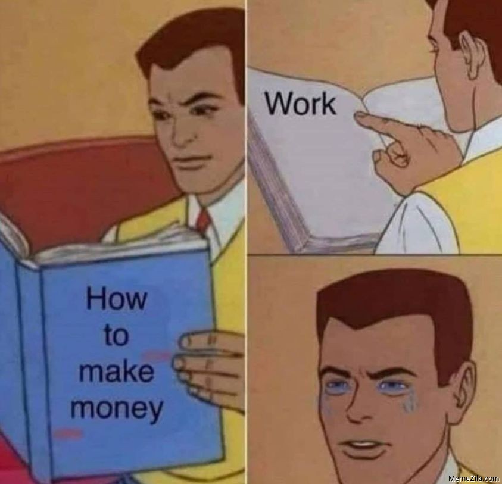

# Your first steps

Pump your interest with those movies:

- [The Wolf of Wall Street](https://www.imdb.com/title/tt0993846/)
- [The Big Short](https://www.imdb.com/title/tt1596363/)
- [Wall Steet](https://www.imdb.com/title/tt0094291/)
- [Wall Street: Money Never Sleeps](https://www.imdb.com/title/tt1027718/)
- [This Giant Beast That is the Global Economy](https://www.imdb.com/title/tt8450534/)
- [The Housing Bubble](https://www.imdb.com/title/tt2448130/)
- [The Wall Street Code](https://topdocumentaryfilms.com/wall-street-code/)
- [Money, Power and Wall Street](https://topdocumentaryfilms.com/money-power-wall-street/)

Here are some good resources to learn as a begginer (beware of the rabbit hole):

| Info | Duration |
| --- | :--: |
| [Crash Course](https://www.youtube.com/watch?v=3ez10ADR_gM&list=PL1oDmcs0xTD-dJN1PL2N1urX0EKupBJCQ) for basic economy. | Long |
| [Khan Academy](https://www.youtube.com/playlist?list=PLSQl0a2vh4HDERCw_ddanXbsDpFWcpL-S) | Long |
| [Banii in miscare (romanian)](https://www.youtube.com/playlist?list=PLXho0H8fG-wUdeRAAZRXXGMMaW4BDybk_) | Very Long |
| [Stock Market Terminology for Dummies](https://www.youtube.com/watch?v=2NZ-Q328UBk) | Short |
| [r/personalfinance](https://www.reddit.com/r/personalfinance/) learn from people like you | - |
| [r/eupersonalfinance](https://www.reddit.com/r/eupersonalfinance/) same as above but for EU | - |
| [r/povertyfinance](https://www.reddit.com/r/povertyfinance/) to save a buck | - |
| [r/FinancialPlanning](https://www.reddit.com/r/FinancialPlanning/top/?t=month) with more people in troubles | - |
| [r/leanfire](https://www.reddit.com/r/leanfire/) when you are 100% on the money making | - |

## Apps to keep track on the money.

| Name | Cost |
| -- | :--: |
| [Google Sheets](https://www.google.com/sheets/about/) | free |
| [Excel](https://www.microsoft.com/en-us/microsoft-365/excel) | $69.99/year |
| [Mint](https://mint.intuit.com)  | Fremium |
| [Goodbudget](https://mint.intuit.com) | Fremium |

### [Next | Where are my money](save-money.md)

