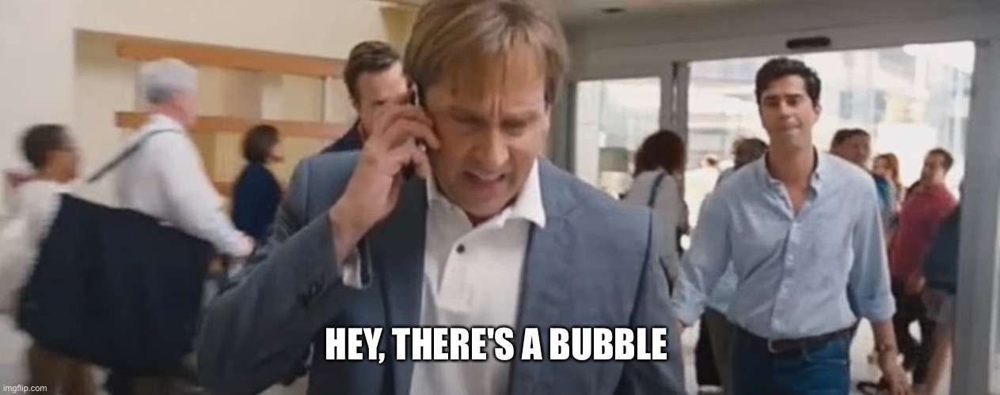

# Information is power

> You can not win a war be living in ignorance - Robert

So you decided that you want to put some money in stocks, index funds, crypto, commodities, etc. And a natural question is: Which is the best now, in 5 years, or 20 years?

If you want to know that, you must be up-to-date with news (like you do with Twitter, Twitch, Instagram, and Reddit drama).

But first, we need to learn when news is an ad or sponsored content:
- [How to Analyze Advertisements](https://www.youtube.com/watch?v=J6a26ndMGXM)
- [Sponsored Content](https://www.youtube.com/watch?v=f0lgW_mqOy8)
- [Sponsored Content: Last Week Tonight with John Oliver](https://www.youtube.com/watch?v=sIi_QS1tdFM)


DON'T be obsessive with public information and don't think you will find a reliable way to build a formula. Remember, significant events happen behind the curtain.

Don't stress yourself when investing; don't be obsessive with the numbers.

### Don't breake the bubble

```
A powerful idea here when we think about sponsored content and news is the incentives. Is there anything the writer/advertiser might win if you do as they say?

Like a real estate developer telling you to buy an apartment from him because it is the best time?   

    - Ionut
 ```



Have you seen a bunch of news that keep spaming the idea to invest in something that **MIGHT** give you some value at the **RIGHT** time?

#### Enters ECONOMIC BUBBLE in the scene.

```
An economic bubble is a situation in which asset prices are much higher than the underlying fundamentals can reasonably justify. Bubbles are sometimes caused by unlikely and overly optimistic projections about the future. They could also be described as prices which strongly exceed the asset's intrinsic value.

They are sometimes referred to as speculative bubbles, financial bubbles, or speculative mania.

In the early stages of a bubble, many investors do not notice the bubble for what it is. People notice the prices are going up and often think it is justified. Therefore bubbles are often conclusively identified only in retrospect, after the bubble has already popped and prices have crashed.

    - Wikipedia
```

Bubbles are a big moment; some make tons of money, and some lose their lives. A bubble is a KINGMAKER and a KINGSLAYER at the same time—the double edge sword.

## Only the language can express your ideas.

```
Words are my eyes.
The eyes to my world.
The world of my beautiful mind.
Twisted and complex.
Only the right words,
Can open my world to you.

 - Robert, in a very poetic moment.
```

That's right; words make our world spin. Everything is built on the ideas, and those who understand its power are those to whom the world belongs.

The book [1984](https://en.wikipedia.org/wiki/Nineteen_Eighty-Four) highlight the powerful idea behind the words of a language. Read more about [Newspeak](https://en.wikipedia.org/wiki/Newspeak).


**Don't forget to read fantasy, poetry, or si-fi books; they are good at explaining new ideas using the current words in the language.**

---

The rabbit hole:

- [How to invest during a market bubble](https://financialpost.com/investing/how-to-invest-during-a-market-bubble)
- [Blowing Bubbles: What Is A Stock Market Bubble?](https://www.forbes.com/advisor/investing/stock-market-bubble/)
- [The intelligent investor](https://www.amazon.com/Intelligent-Investor-Definitive-Investing-Essentials/dp/0060555661/ref=sr_1_4?crid=2GE3X6RT8XZUO&keywords=the+inteligent+investor&qid=1652953715&sprefix=the+intelligent+investor%2Caps%2C190&sr=8-4) by Benjamin Graham
- [The Snowball: Warren Buffett and the Business of Life](https://www.amazon.com/Snowball-Warren-Buffett-Business-Life/dp/0553384619/141-9089874-7772166?psc=1) by Alice Schroeder
- [The Power of Habit: Why We Do What We Do in Life and Business](https://www.amazon.com/The-Power-of-Habit-Charles-Duhigg-audiobook/dp/B007EJSMC8) by Charles Duhigg
- [Elon Musk: Tesla, SpaceX, and the Quest for a Fantastic Future](https://www.amazon.com/Elon-Musk-Ashlee-Vance-audiobook/dp/B00UVY52JO) by Ashlee Vance
- [Atomic Habits](https://www.amazon.com/Atomic-Habits-James-Clear-audiobook/dp/B07RFSSYBH/ref=zg_bs_6512002011_1/141-9089874-7772166?pd_rd_i=B07RFSSYBH&psc=1)
by James Clear
- [The Psychology of Money: Timeless lessons on wealth, greed, and happiness](https://www.amazon.com/Psychology-Money-Timeless-lessons-happiness/dp/0857197681/) by Morgan Housel
- [The Witcher](https://en.wikipedia.org/wiki/The_Witcher) by 	Andrzej Sapkowski
- [A Song of Ice and Fire](https://en.wikipedia.org/wiki/A_Song_of_Ice_and_Fire) by George R. R. Martin
- [The Lord of the Ring](https://en.wikipedia.org/wiki/The_Lord_of_the_Rings) by J. R. R. Tolkien
- [Dune](https://en.wikipedia.org/wiki/Dune_(franchise)) by 	Frank Herbert
- [Foundation](https://www.amazon.com/Foundation-Complete-Books-Trade-Paperback/dp/B09J7X3TQS) by Asimov
- [The Chimp Paradox](https://www.amazon.com/Chimp-Paradox-Management-Program-Confidence/dp/039916359X) by Dr. Steve Peters
- [How to Buy Pre-IPO Stock: 3 Ways to Get in on the Action Early](https://finmasters.com/how-to-buy-pre-ipo-stock/)
- [Best Investing Books Every Investor Must Read](https://finmasters.com/best-investing-books/)
- [How to Research and Choose Stock (And Whether or Not You Should)](https://finmasters.com/research-and-choose-stock/)

Podcasts recommendation:

- [Berkshire Hathaway Annual Shareholder Meetings](https://podcasts.apple.com/ro/podcast/berkshire-hathaway-annual-shareholder-meetings-since/id1445276006)  (here is also a [video](https://www.cnbc.com/video/2022/05/01/watch-warren-buffett-and-charlie-munger-preside-over-full-berkshire-hathaway-annual-meeting.html) from the latest one April 2022.)