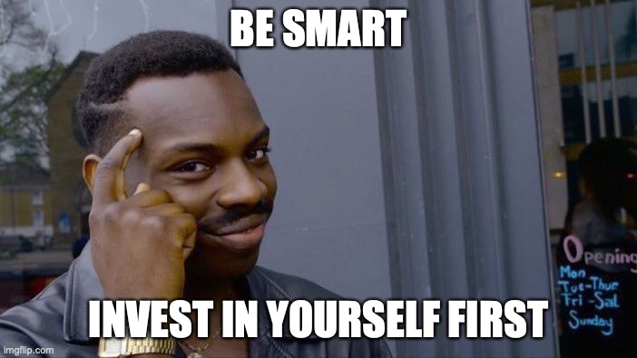

# The big sky of investment

If you go to Google and type "Investment", you will see things about Investment funds, the stock market, and other items from the financial world.

If you to go Wikipedia, you will find this:

> Investment is the dedication of an asset to attain an increase in value over a period of time. Investment requires a sacrifice of some present asset, such as time, money, or effort.

That asset can also be **you** or a tool.



### If you are a programmer

...I can bet 20$ that you do not invest too much in programming tools or a comfy chair or exercise at regular hours. You can find a good free tool that does a decent job of completing your task. But imagine how much mental energy you can save with the right tool that can answer your question before draining too much mental energy.


### If you write a lot of email writing

Tools like template snippets, hotkeys, Grammarly, and issue search can help a lot in time-saving. Time to find tools that minimize the manual work.

### How to do that?

It is effortless to tell someone to invest in himself without giving him a direction. It is tough to tell someone what to invest. Everyone is different.

Many people want to invest in themselves, but they don't have a starting point and don't know how to find it. And this is the million-dollar question: *How can someone find what he would like to do?*

The closest million-dollar answer is: "Find it until your last breath". This lame statement is the most immediate answer that you can find right now. Your family told you to follow a path. Your friends told you to follow a path; your mentor told you to follow a path. But at the end of the day, it is your choice to make.

This sounds like I will take you on a spiritual journey, but no. The explanation is much more straightforward.

Nature has made you with only a scope: survive to pass your genes. The rest of your life is just extras. Your education, career, and knowledge are all yours to decide. Nature does not care about them -- you can consider this your true *free will*.

Maybe a smart AI can give you scope in life in the future. Until then, you have to use your limited resources to find out what you can do better. Thinking for yourself is one of the most challenging things in life.

If you think Nature is senseless, think twice. You can look at those clips to see a fraction of the Big Scheme.

- [Coastal Seas](https://www.youtube.com/watch?v=r9PeYPHdpNo)
- [High Seas](https://www.youtube.com/watch?v=9FqwhW0B3tY)
- [Frozen Worlds](https://www.youtube.com/watch?v=cTQ3Ko9ZKg8)
- [From Deserts to Grasslands](https://www.youtube.com/watch?v=XmtXC_n6X6Q)

One good tip is to note down all the important decisions in your life. Put a date and how you felt about it. It will help you to track your progress.

### The Endgame

After investing in yourself and your tools, you will most likely be on a cash surplus. At this point, you have acquired a decent life and a good enough future.

You can stop here and put the surplus into saving that keep up with the inflation. This is mostly what the majority do. **You have reached the endgame.**

At the endgame, you can make big decisions that can radically change your life in 7-30 years. You can save and live your life as it is or gamble them for higher risk (for a darker or brighter future).

Some piece of knowledge from @ineagu

>A rule that I always knew and it helped me is that there is no free lunch. There is no way that you do nothing that your money just grows by investing in whatever people are promoting nowadays.  
>Every investment has a risk, the higher the return, the higher the risk.  
>If you want to have an "edge", which means to earn more, with a lower risk you need to bring something to the table.  
>For e.g I am hoping for more return by investing in a wordpress plugin, because we do have the know-how and we'll put the work to get better than average results. 

Internet wisdom
```
Buy low, sell high.
```

## The Lake And The River

Your sign is the Lake if you like to invest money in a low manner. You usually think a lot about what to do. You think about the risk and how much you can take. You don't like things that move too fast. You want some time to think about it. [Huhh?](https://www.msn.com/en-us/money/savingandinvesting/worried-about-the-stock-market-try-warren-buffetts-investing-strategy/ar-AAXvSkw)

Your sign is the River if you like to see money flow. Risk is a part of your personality; it defines you. You want money now. You want speed. Waiting for it is suffering. Time is money. [Huhh?](https://www.investopedia.com/articles/trading/05/011705.asp)


### [Next | True Power](information-is-power.md)
