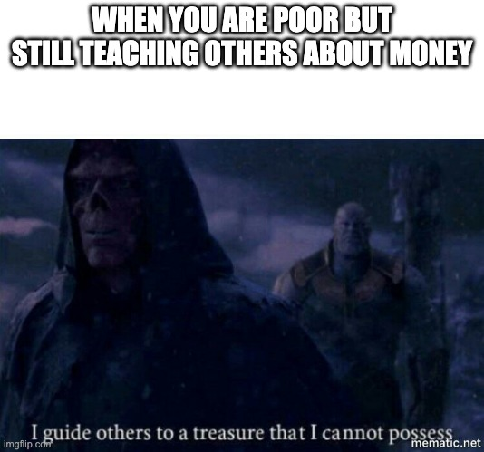
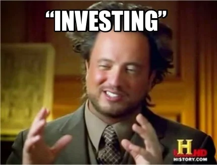

# Lost in a material world

You are here because you want to learn about money. Why? Because they can solve almost all your problems, and they are hard to make.

> “Money, if it does not bring you happiness, will at least help you be miserable in comfort.”
– Helen Gurley Brown

Even I do not know much about money. But we can explore it together.

Money is like cats. You can raise them, groom them, and play with them. But at the end of the day, they do what they want. You are the only one who thinks that they belong to you. Cats are always thinking that you are a mere servant.

> Nobody can be a master of the coin. -- Robert, while eating a cake.

Right now, you are making money mainly from a salary. From a salary three paths open up:

1. Grow your salary.
2. Invest a small portion of it.
3. Open a business.

To grow your salary, you need to increase your labor value. To open a business, you will need an idea and some capital. Both are hard to do, but you can make money in the short term (1-5 years). 

Belive it or not, but world economy is big *CASINO*. Some lose, some wins, some go bankrupt, some become the richest persons in the world (see [Elon Musk](https://www.cbsnews.com/news/elon-musk-300-billion-net-worth/)). Take a look at [r/wallstreetbets](https://www.reddit.com/r/wallstreetbets/)

YOU CAN INVEST IN ANYTHING: you, your family, your pet, stocks, bonds, oil, art, tech, education, etc. [You can even bet your a money gains others betting](https://www.investopedia.com/terms/s/shortselling.asp).

With investment in things like bonds, stocks, index funds, you are playing a long-term game. You don't have to do much about money. Money increases its value by simply moving from pocket to pocket. BUT you need to be prepared when you cash them out (7 - 3o years).

You are thinking that investment is for people who know a lot about the domains. But in reality, nobody knows how to invest. Even a monkey can a do a good investment. [Learn more about smart monkeys.](https://www.wsj.com/articles/SB991681622136214659)

> “A blindfolded monkey throwing darts at a newspaper’s financial pages could select a portfolio that would do just as well as one carefully selected by experts.”
-Burton Malkiel, Asset manager and author of A Random Walk Down Wall Street.

So why a guide about making money when is so simple? Well, you have to learn to avoid scams. Many people will try to trick you, and you will need the knowledge to see through their lies. Right now (May 2022), a crypto campaign is still going on, attracting celebrities and promising a lot. [Learn more about their type of scams.](https://www.forbes.com/advisor/investing/cryptocurrency/bitcoin-scams-fraud/)

The biggest enemy that blocks you from making much money is your judgment. A good judgment in which place to put your money makes all the difference.
In this handbook, you will learn on how to train your judgement.

## IS TIME TO LEARN TO MAKE MORE MONEY

