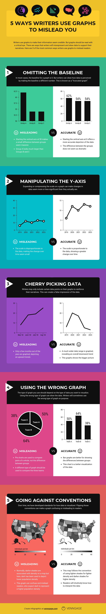

# Gambling the money in stocks

Maybe you have friends who are intro sport beting, maybe some are into day tradeding (buy low, sell high?), and start asking yourself. Do they make money?

The majority of your friends will likely be in the negative side of the gains, but you will have that special friend that makes a lot of money and brags about it. Naturally you are curios about it. You might be tempted to try.

Sport betting is more about passion and confidence than strategy. You can recevice some good tips, but you can not do much about it.

On the other hands, Stocks are the true battleground for money. Stocks can make a person rich like a king or extremily poor in just a milisecond.

This battleground is very hard for the biggeners. You will need a lot a knowledge to understand the risk and evaluate it.

If you want to know if a company is good to invest in their stock, you will most likely be in this situation:

---

You write on Google: `tesla value`, and this page appears:

The first thing you are going to see is a market summmary that shows you the evolution of Tesla stocks. Naturally, if you want to judge coreclty a company you need to understand that graph.

If you want to see more, press the [More about Tesla Inc.](https://www.google.com/finance/quote/TSLA:NASDAQ)

---

### Basic example

The stock chart is a graph that displays the price of an investment over a period of time. You can use the charts to forecast future price movements. 

The primary purpose of any chart is to show you: 
- the price of an investment
- change over time

The most used are: 

- Line chart 

- Bar Chart

- Candlestick Chart

> Personally, I use the line chart more when I look at companies because I look at the last 1-3 years and how it has evolved from listing to the present. This makes it easier for me to make an impression. - Madalin 

[Here](https://www.youtube.com/watch?v=Lz9ysR-a0RQ) is a short video with all the details https://www.youtube.com/watch?v=Lz9ysR-a0RQ 

YOU NEED SOME BASIC KNOWLEDGE ABOUT READING GRAPH AND CHARTS.

Your rabbit hole awaits you:

- [44 Types of Graphs Perfect for Every Top Industry](https://visme.co/blog/types-of-graphs/)
- [Over 60 New York Times Graphs for Students to Analyze](https://www.nytimes.com/2020/06/10/learning/over-60-new-york-times-graphs-for-students-to-analyze.html)
- [The Only Candlestick Patterns Trading Video You Will Ever Need... (Beginner To Advanced)](https://www.youtube.com/watch?v=hEUALimWs7E)

## I want to lie

> Bro, I have this cool idea. It's awesome. Look at my statistics. It's 100% legit.

## Platforms

Choosing a platform depends a lot on the law & taxes of your country. You need to pay attention to the commissions of each forum. Beware of their marketing; they are very aggressive. It is better to ask some friends who use those platforms (ask them about additional contracts and how they cash out the money) to understand better how it will work for you.

### [Next | Unlimited power](scripting.md)