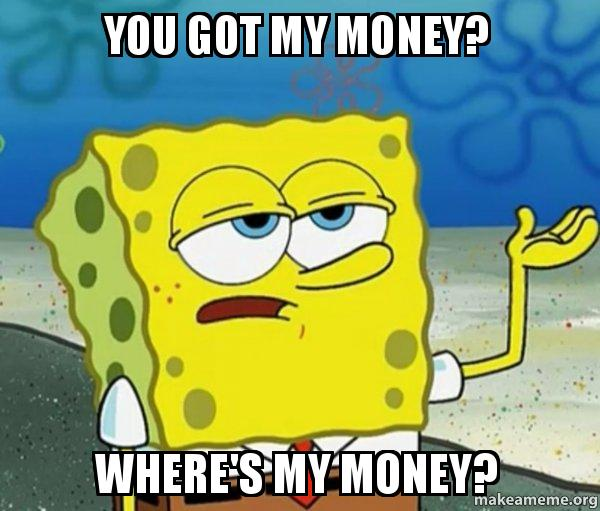
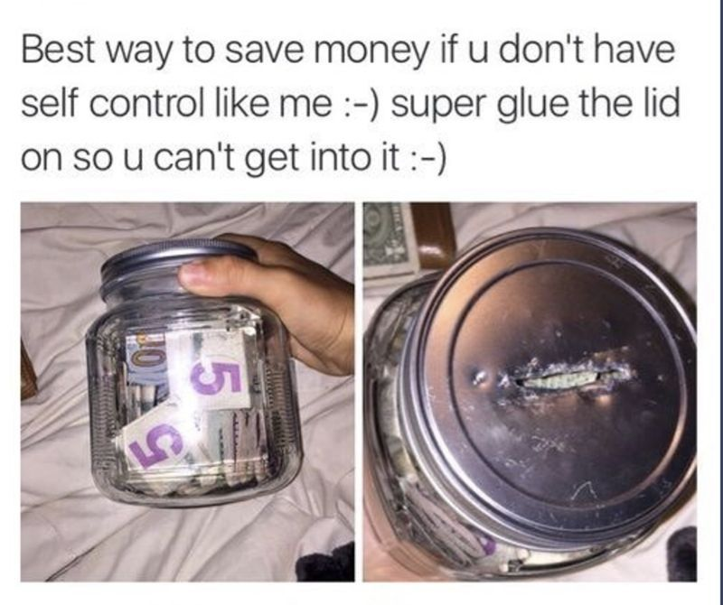

# How to save money

Before saving money, you need to know where your money goes.

Take a pen and a paper, or open a Spreadsheet App and write down how much money you have right now.

Example:

| Source | Amount |
| -- | :--: |
| Savings | 4000$ |
| Salary | 1000$ |

And now for monthly fixed (or almost fixed) expenses.

| Source | Amount |
| -- | :--: |
| Neftflix | 10$ |
| Internet | 15$ |
| Utilities (electricty, water, internet) | 130$ |
| Rent | 200 $ |

So, from your salary, you will remain with 645$. With those, you will spend them on food and other consumables. 

A good rule is to save 20% from your salary, in this case, 200$ . You will remain with 445$ .

From that 20%, half can go to a saving account, so 100$ . The other 100$ can to investment. With a salary of 1000$ , based on this formula, you will invest 1 200$ per year.

It looks like a really small sum, but it is a little over one month's salary. So one salary will go-to investment every year.

What about the 4000$ in savings? Well, you can not put all your money in investment. You will need it when urgency happens: you are fired, a medical problem appears, and your phone has stopped working.

If your savings are really big, then you can try to invest them in stocks, index funds, etc.

### Saving

You will find a lot of tips on how to save money, especially on sites like [r/povertyfinance](https://www.reddit.com/r/povertyfinance/wiki/index).

But you need to remember that some things have a hidden cost. The one of them is health. Health problems are like a debt, and like investment, they grow over the years (and unfortunatly they do not crash). This debt, might be so big that all the money that you saved over the years will not help.

Habbits have an hidden cost.

| Habbit | Cost |
| -- | :-- |
| Smoking | Health problem + daily cost of ciggars |
| Junk food | Health problems over the years |
| Social Media | Mental Health - low esteam that decrease productivy or increase consumerism |
| Greed | Not spending money tool that can save money and boost productivity or healthcare |
| Ignorance | Ignore your other problems |

Remember that you can invest in yourself (learn a skill, new language, etc). 1 200$ can make a difference.
